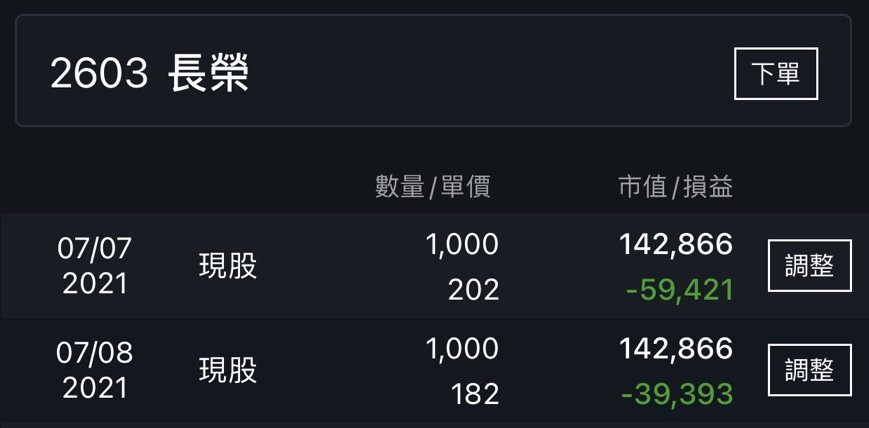
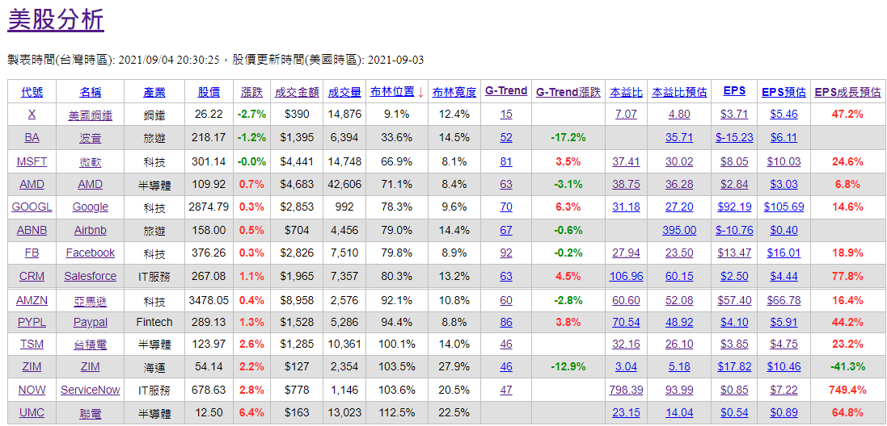
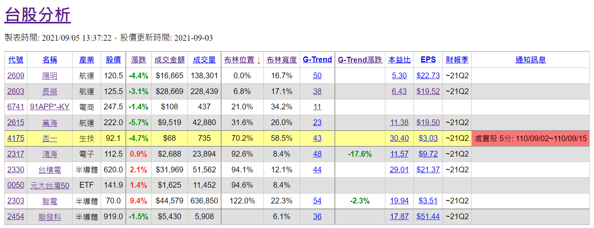
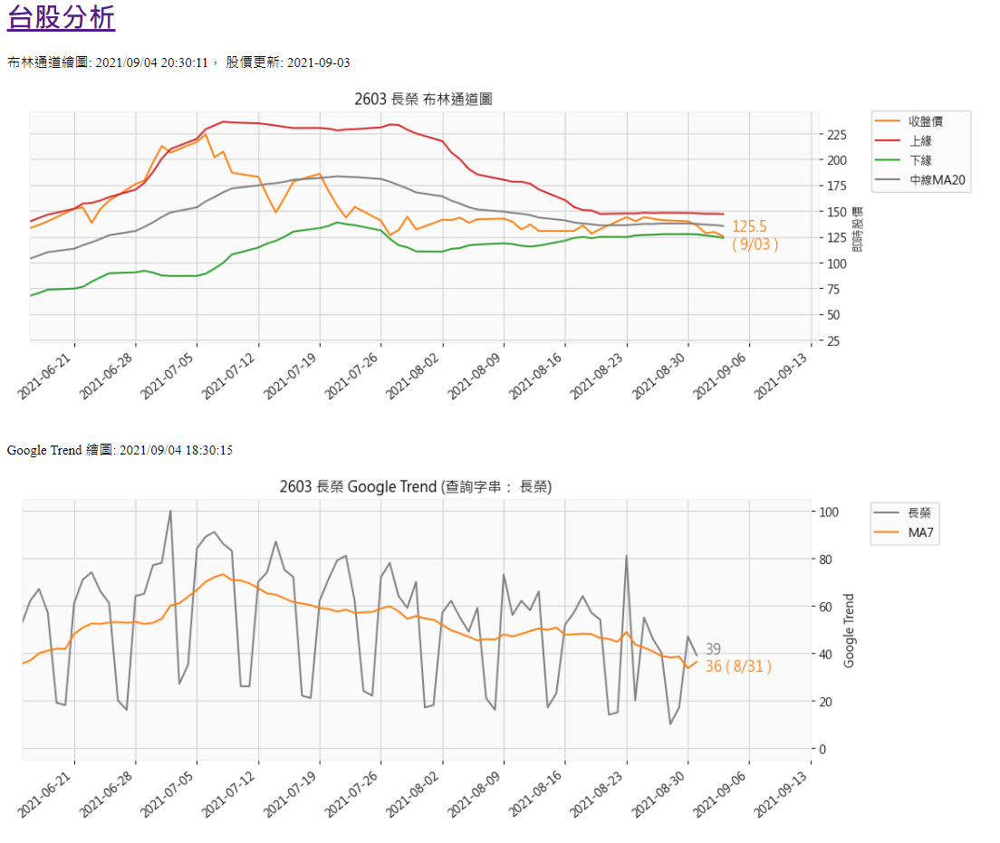
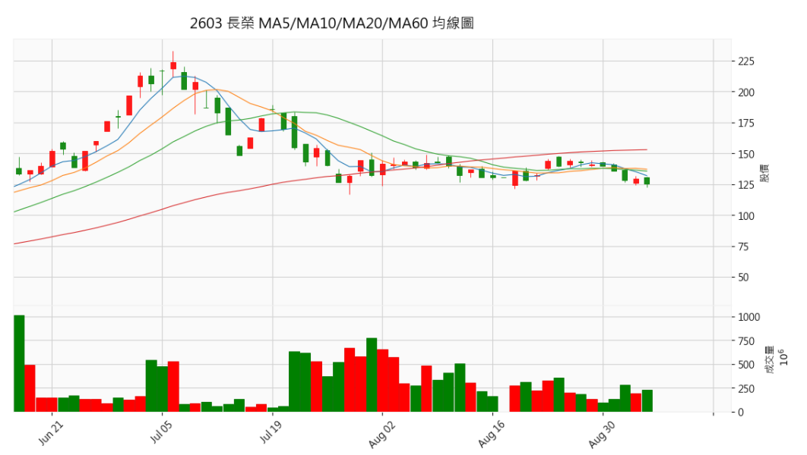
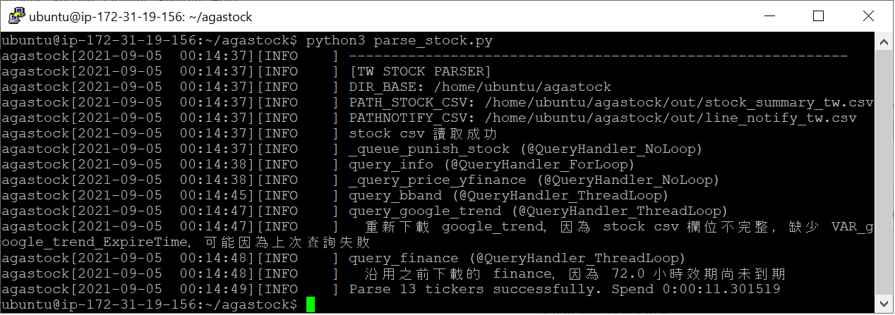
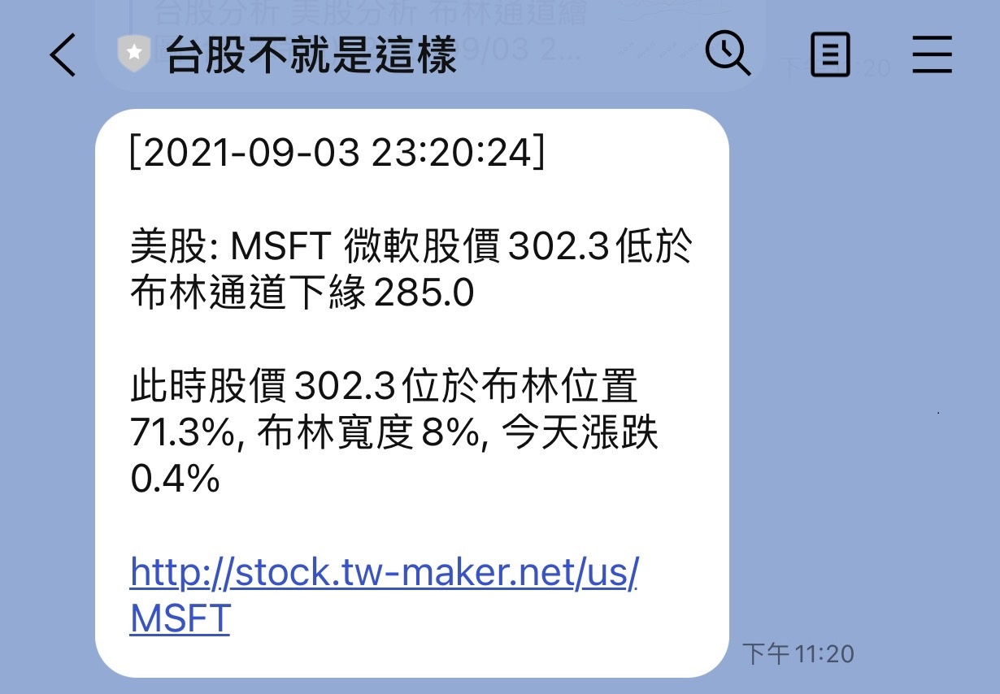
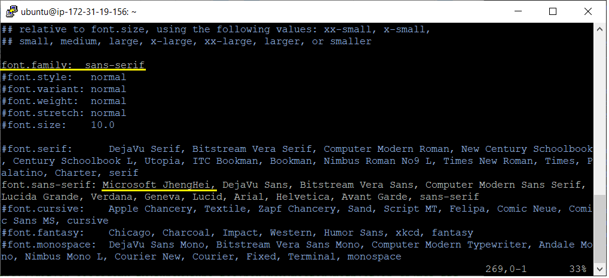

# agastock
 
## 開發動機
就在海運飆漲的2021年7月，差點跪在地上喜迎財富自由的當下，EPS超高好消息不斷的長榮竟然套在202元一去不回，有圖有真相(哭)      
   

忽然體會到追高殺低不是辦法，魯蛇靠邏輯分析也能出頭天，經過三個月無數個不出門的周末，產出個簡單的爬蟲和分析工具。

上過金融研訓院的量化交易課，老師說好策略不用程式也能賺錢，爛策略走程式賠更快。開源不見得能產出好策略，但希望能集眾人力量產出策略平台，希望大家給予寶貴的建議！

## 簡介
針對設好的台股美股清單，定期下載股票資訊，計算布林通道，Google Trend 等指標，取得 EPS 及本益比，並在指標觸發時發 LINE 通知，提醒買賣股票

觸發條件：  
 - 台股列為處置股
 - 股價低於布林通道下緣（並且布林寬度不會太窄）
 - Google Trend 和過去三日最低值比較大幅上升，或過去三日最高值比較大幅降低
 - Google Trend 七日移動平均，和上週比較大幅升高或降低

資料來源：  
 - FinMind： 台股EPS及本益比（之前需要付費帳號才能下載，現在好像不用）
 - 證交所、櫃買中心： 台股處置股、股票名、產業別
 - Yahoo Finance：使用 yfinance 取得台股美股的即時股價、歷史成交價，美股EPS及本益比。台股延遲報價20分鐘，美股無延遲
 - Google Trend： 使用 pytrends 取得 Google 搜尋量統計

展示網站: http://stock.tw-maker.net

## 執行介面
網頁顯示結果 [web_root.py](agastock/web_root.py):
   
   
   
  

分析程式 [parse_stock.py](agastock/parse_stock.py):
   

LINE 通知:  
   

## 如何開始
1. 以下步驟於 Ubuntu 18.04 測試  
1. 安裝 Python 及 agastock 需要的相依套件，Python 之外還需要300MB空間
    ```sh
    sudo apt-get update
    sudo apt install python3 python3-pip  
    pip3 install pandas numpy matplotlib pandas_datareader mplfinance yfinance \
             twstock line-bot-sdk flask pyquery colorlog pytrends 
    ```
1. 更新 twstock 台股名稱資料庫，才能查詢到新上市股票的名稱，產業，及上市上櫃別。依照 yfinance 要求，查詢股價時將為上市台股代號加.TW，上櫃加.TWO，例如 91APP 為 6741.TWO  
    ```sh
    python3 -c "import twstock;twstock.__update_codes()"
    ```   
1. 安裝 ta-lib 以計算布林通道及移動平均。直接 pip3 install 會失敗，改用手動編譯	
    ```sh
    wget http://prdownloads.sourceforge.net/ta-lib/ta-lib-0.4.0-src.tar.gz
    tar -zxvf ta-lib-0.4.0-src.tar.gz  
    cd ta-lib  
    ./configure --prefix=/usr  
    make  
    sudo make install  
    pip3 install ta-lib  
    ```  
1. 使用 matplotlib 繪圖，需設定中文字形，不然圖片的中文字無法顯示  
    1. 編輯 matplotlib 設定檔
        ```sh  
        mpath=`python3 -c "import matplotlib;print(matplotlib.matplotlib_fname())"`
        echo $mpath   #ex. ~/.local/lib/python3.8/site-packages/matplotlib/mpl-data/matplotlibrc 
        vi $mpath
        ```
    1. 將 font.family 與 font.**sans**-serif 註解(#)移除，並在 font.sans-serif 後方加入 Microsoft JhengHei (注意不是 font.**serif**，兩個很像)。範例：  
           
      
    1. 下載微軟雅黑 (Microsoft JhengHei) 字型，複製到 matplotlib 字型目錄
        ```sh  
        dpath=`python3 -c "import matplotlib;print(matplotlib.get_data_path())"`
        wget "https://gitlab.aiacademy.tw/junew/june_toolbox/raw/master/matplotlib_ch/msj.ttf"    
        mv msj.ttf "$dpath/fonts/ttf/"  
        ls $dpath/fonts/ttf/msj.ttf  
        ```   
    
    1. 刪除字型暫存檔，下次 import matplotlib 才會重讀設定檔   
        ```sh  
        fpath=`python3 -c "import matplotlib;print(matplotlib.get_cachedir())"`
        echo $fpath  #ex. ~/.cache/matplotlib
        rm -f $fpath/fontlist*.json  
        ```
  
1. 取得 agastock source code    
    ```sh
    cd ~  
    git clone https://github.com/gavinage0/agastock.git
    cd agastock/agastock/
    ```   
    
1. 分析台股美股 
    ```sh 
    python3 parse_stock.py -tw  #should print "Parse XX tickers successfully"
    python3 parse_stock.py -us  #should print "Parse XX tickers successfully"
    ls out  #should print "line_notify_tw.csv line_notify_us.csv stock_summary_tw.csv stock_summary_us.csv"
    ```  
    確保 /agastock/out/ 目錄有產生以上四個 csv 檔案
    
1. 執行 flask web server
    ```sh
    python3 web_root.py  
    ```
    以瀏覽器開啟網址，若是本機可開啟 http://127.0.0.1:8080/ ，網頁應顯示剛產生的 stock_summary_xxw.csv。若是EC2，Flask印出的log可能是內網IP地址，外網IP地址要到EC2管理介面查看
    
1. 設定台灣時區並編輯排程
    ```sh 
    sudo timedatectl set-timezone "Asia/Taipei"  
    sudo nano /etc/crontab  
    ```
    
    貼上以下設定，美股開盤時間每10分鐘更新，盤後每2小時更新。台股開盤時間每10分鐘更新，盤後每2小時更新。  
    /home/ubuntu/agastock/agastock 須置換成實際路徑  
    ```python    
    #agastock bootup  
    @reboot ubuntu  cd /home/ubuntu/agastock/agastock && /usr/bin/python3 web_root.py  
    @reboot ubuntu  cd /home/ubuntu/agastock/agastock && /usr/bin/python3 parse_stock.py -tw  
    @reboot ubuntu  cd /home/ubuntu/agastock/agastock && /usr/bin/python3 parse_stock.py -us  
    
    #agastock tw
    */10   9-15   * * 1-5  ubuntu cd /home/ubuntu/agastock/agastock && /usr/bin/python3 parse_stock.py -tw  
    30     */2    * * *    ubuntu cd /home/ubuntu/agastock/agastock && /usr/bin/python3 parse_stock.py -tw  
    
    #agastock us
    */10   21-23  * * 1-5  ubuntu cd /home/ubuntu/agastock/agastock && /usr/bin/python3 parse_stock.py -us  
    */10   0-4    * * 2-6  ubuntu cd /home/ubuntu/agastock/agastock && /usr/bin/python3 parse_stock.py -us  
    30     */2    * * *    ubuntu cd /home/ubuntu/agastock/agastock && /usr/bin/python3 parse_stock.py -us      
    ```
  
1. 重開機觸發排程  
    ```sh  
    sudo reboot
    ```
    
1. 重開機後 [web_root.py](agastock/web_root.py) 應該自動執行。再次檢查 http://127.0.0.1:8080/ 是否正常顯示台股美股
   
1. 更改Ubuntu防火牆設定，確保外網可連接，測試外網網址

## 其他設定
[config.py](agastock/config.py) 包含所有設定，常變更的有：

- 若要啟用Line通知，需申請免費的LineBot，https://developers.line.biz/zh-hant/  
   申請完的帳號填入 LINEBOT_ID 及 LINEBOT_TOKEN 
   
- 美股清單: US_TICKER_LIST  
 
- 台股清單: TW_TICKET_LIST   
 
- 用於LINE通知的網址: WEB_BASE_URL

- 布林通道通知條件: NOTIFY_BBAND_HIGHER、NOTIFY_BBAND_LOWER

- Google Trend 通知條件: NOTIFY_GT_MA7_RISE_RATE、NOTIFY_GT_MA7_RISE_TO 等等 
   
- flask web server:  
    - WEB_DEBUG_FLASK 設定 True，可開啟 flask 除錯功能，每次修改 [web_root.py](agastock/web_root.py) 將觸發 flask web server 自動重啟
    - WEB_SERVER_PORT 可更改綁定的 port。若設定標準 http port 80，在 ubuntu 需執行下命令</font>  
        ```sh sudo 
        pypath=$(realpath /usr/bin/python3)  #ex. /usr/bin/python3.8
        sudo setcap 'cap_net_bind_service=+ep' $pypath
        ```

## 錯誤排除
- 若重開機後無法開啟網頁，可查看 cron log 看是否出錯
    ```sh    
    grep CRON /var/log/syslog  
    ```
    應該要看到
    > <sup>ubuntu@ip-172-31-19-156:~$ grep CRON /var/log/syslog  
    > Sep  4 23:20:15 ip-172-31-19-156 cron[443]: (CRON) INFO (pidfile fd = 3)  
    > Sep  4 23:20:15 ip-172-31-19-156 cron[443]: (CRON) INFO (Running **@reboot jobs**)  
    > Sep  4 23:20:15 ip-172-31-19-156 CRON[501]: (ubuntu) CMD ( cd /home/ubuntu/agastock/agastock && /usr/bin/python3 **web_root.py**)  
    > Sep  4 23:20:15 ip-172-31-19-156 CRON[494]: (ubuntu) CMD ( cd /home/ubuntu/agastock/agastock && /usr/bin/python3 **parse_stock.py -us**)  
    > Sep  4 23:20:15 ip-172-31-19-156 CRON[500]: (ubuntu) CMD ( cd /home/ubuntu/agastock/agastock && /usr/bin/python3 **parse_stock.py -tw**)  
    > Sep  4 23:20:17 ip-172-31-19-156 CRON[454]: (CRON) info (No MTA installed, discarding output)  
    > Sep  4 23:20:30 ip-172-31-19-156 CRON[453]: (CRON) info (No MTA installed, discarding output)  
    > Sep  4 23:20:42 ip-172-31-19-156 CRON[452]: (CRON) info (No MTA installed, discarding output)</sup>  
  
- 若執行 [parse_stock.py](agastock/parse_stock.py) 出現以下錯誤，可能微軟雅黑字型尚未下載，請參照前面說明下載微軟字型
    > /home/user/.local/lib/python3.8/site-packages/matplotlib/backends/backend_agg.py:203: RuntimeWarning: Glyph 20729 **missing from current font**.
      font.set_text(s, 0, flags=flags)
      
- 若網頁顯示不正常，漏資料，可在網頁下方下載 "*tw log file" 或是 "*us log file"，也可在以下路徑觀看log:
    * ~/agastock/static/logs/stock_parser_tw.log  
    * ~/agastock/static/logs/stock_parser_us.log   

    或著手動執行以下命令看是否產生錯誤
    ```sh  
    cd ~/agastock   
    python3 parse_stock.py -us  
    python3 parse_stock.py -tw  
    ```

- 以下指令可刪除輸出和暫存檔，恢復初始狀態（需改成實際路徑）
    ```sh  
    rm -f /home/ubuntu/agastock/agastock/out/*  /home/ubuntu/agastock/agastock/static/logs/* \
          /home/ubuntu/agastock/agastock/static/img/* /home/ubuntu/agastock/agastock/__pycache__/* \
          /tmp/parse_stock_*.lock 
    ```
- 可在 [config.py](agastock/config.py) 開啟以下除錯功能：
    * PARSE_STOCK_LOG_LEVEL 改成 logging.DEBUG 印出除錯訊息
    * WEB_DEBUG_SHOW_ALL_COLUMNS 設定 True，在網頁顯示 stock_summary_xx.csv 隱藏欄位
    * ENABLE_GLOBAL_LOG 設定 False，印出所有 module 的 debug print，其中 request module 訊息可了解爬蟲運作
    * MULTI_THREAD_SUPPORT 設定 False，把使用 multi-thread 的 queue_xxx() 改用 single-thread，若懷疑是 multi-thread 問題可幫助除錯
  
- 若新上市台股無法取得名稱，可執行以下指令更新台股清單
    ```sh
    python3 -c "import twstock;twstock.__update_codes()"
    ```   
    再執行 parse_stock.py -tw 重新爬蟲

## 各套件使用限制
- FinMind： [官網說明](https://finmindtrade.com/analysis/#/Sponsor/sponsor) 未輸入TW_FM_TOKEN每小時300次，免費會員每小時600次，付費Backer提高到每小時1600次
- 證交所： [根據twstock說明](https://github.com/mlouielu/twstock)，每 5 秒鐘 3 個 request，超過的話會被 ban 掉，據說每次request間隔1秒即可，
- Google Trend： [據此部落格](https://github.com/GeneralMills/pytrends/issues/202)說明，每小時400次
- LINE bot ：[官網說明](https://tw.linebiz.com/service/account-solutions/line-official-account/)，LINE Message API 免費帳號一個月可傳送 500 則訊息。
- Yahoo Finance： [據此部落格](https://towardsdatascience.com/free-stock-data-for-python-using-yahoo-finance-api-9dafd96cad2e)說明，每小時 2000次 request

## 檔案結構
```python
agastock
│   README.md      #本說明檔
│   web_root.py    #使用 flask framework 的網頁主程式
│   parse_stock.py #定期執行的 parser 主程式  
│   stock_base.py  #clas StockBase
│   stock_tw.py    #class StockTwn，寫入 stock_tw.csv 及 line_notify_tw.csv
│   stock_us.py    #class StockUs, 寫入 stock_us.csv 及 line_notify_us.csv
│   common.py      #stock_XX.py 和 web_root.py 共用的設定檔及 library function
│   agalog.py      #logging
│   config.py      #設定檔
│
└───out #儲存 parse_stock.py 輸出
│   │   line_notify_tw.csv   #儲存台股LINE通知紀錄，相同原因等過期再觸發才會重傳
│   │   line_notify_us.csv   #儲存美股LINE通知紀錄，相同原因等過期再觸發才會重傳
│   │   stock_summary_tw.csv   #儲存台股parse結果
│   │   stock_summary_us.csv   #儲存美股parse結果
│   
└───static   #flask framework 指定的靜態檔案目錄
│   │   style.css  #網頁共用的 style
│   │   img   #儲存 parse_stock.py 輸出的股票圖片
│   │   logs   #儲存 parse_stock.py 產生的 log
│   
└───templates   #flask framework 指定的 html template 目錄
    │   detail_tw.html
    │   detail_us.html
    │   summary_tw.html
    │   summary_us.html
```

## 軟體設計筆記
- [parse_stock.py](agastock/parse_stock.py) 為股票分析主程式，使用 StockUs 和 StockTwn 取得美股台股資料，將不同股票(ticker)儲存於 _data[ticker]。各個 _data[ticker] 一開始為無元素 dict， 建立步驟為：
    - queue_xxx() 根據參數 init_vars[col1, col2...]， 將 _data[ticker] 加入新的 column，成為  _data[ticker][col1], _data[ticker][col2],..., 並填入初始值 float('nan')
   
    - 初始值選用 float('nan') 的優點是，它可被印出 "%f"%float('nan') 也可做數學運算 float('nan') + 1，結果都是 nan 但不會觸發 exception，可簡化錯誤處理. 但不能使用 %d 列印, '%d'%float('nan') 會造成 exception

    - queue_xxx() 從網路下載股票資料，將有下載到的資料填入 _data[ticker][col]. 無資料 column 還是 float('nan')，例如新股91app尚無年度EPS
 
- _data[] column 命名規則：  
    - 一般股票資訊: 只有這類會顯示在 [web_root.py](agastock/web_root.py) 產生的網頁，例如名稱，股價，G-Trend等. 以下三類皆不顯示
    1. TMP_XXX: 分析股票過程暫存，不會寫入 stock_summary_xx.csv，例如TMP_GTName
    1. VAR_XXX: 和 ticker 無關的變數，只存在 _data[first ticker][VAR_XXX]，例如 VAR_WebMsg 為網頁下方警告訊息
    1. HD_XXX: 其他隱藏欄位，例如 HD_GT_URL 是讓 [web_root.py](agastock/web_root.py) 產生 Google Trend 超連接使用
     
- queue_xxx() 股票分析函式
    - 若發生錯誤，應呼叫 _add_err_msg() 及 add_warn_msg()，將錯誤儲存於給 VAR_WebMsg 給在網頁顯示
   
    - 為了方便增加新的 queue_xxx()，使用Decorator 設計通用的 QueryHandler，包含以下功能：
        1. 執行函式前，根據 init_vars[] 初始化 _data[ticker][col]
        1. 使用 exception handler 保護，確保 parse_stock.csv 執行成功並寫入 stock_summary_xx.csv
        1. 支援 multi-thread，容易在 single-thread 及 multi-thread 之間切換
        1. 支援股票資料緩存，過期才需要重新下載，避免存取過於頻繁被網站 ban，例如測試時常超過 Google Trend 每小時 400 次限制
     
    - QueryHandler 包含以下三種：
        - @QueryHandler_NoLoop: 由函式自行處理 ticker loop，例如台股 _query_punish_stock() 需一次下載所有處置股
        - @QueryHandler_ForLoop: 以 single-thread 處理 ticker loop，函式只需處理單支 ticker，例如台股 query_info() 是簡單的迴圈，適合用 single-thread
        - @QueryHandler_ThreadLoop: 以 multi-thread 處理 ticker loop，函式只需處理單支ticker，例如美股 query_info() 下載每支股票需時5秒， multi-thread 可大幅加速
       
    - QueryHandler 使用方式:
        - @QueryHandler_ForLoop( expire_hours=TT, init_vars=['XX','YY'] ) 
        - 參數 expire_hours 啟動用緩存功能，忽略此參數代表每次執行 [parse_stock.py](agastock/parse_stock.py) 都重新查詢，例如 query_price()
        - 參數 init_vars 供 _data[ticker][col] 初始化使用

    - 使用 QueryHandler 的 queue_xxx() 需符合以下介面，分為兩類:  
        1. query_XX(self) <font color=#008000> #@QueryHandler_NoLoop </font>  
        1. query_OO(self, ticker, tdata, prev_tdata)  <font color=#008000> #@QueryHandler_ForLoop, @QueryHandler_ThreadLoop </font>  
        - 查詢成功回傳True，若有設定 expire_hours 代表到期前不再查詢。失敗回傳False  

    - Thread
        - 被 @QueryHandler_ThreadLoop 修飾的 queue_xxx() 支援 multi-thread，只能呼叫 thread-save 函式
        - 若需呼叫非 thread-save 函式:  
            - 自定 function 可使用 @ThreadSaver 保護，例如 _add_warn_msg()
            - 系統 function 可使用 _thread_mutex.acquire() 及 _thread_mutex.release() 保護，例如 matplotlib

- 指標設計
        - Google Trend 搜尋時間段可設定以下參數: 
            1. 'today 12-m' 回傳一年資料，以週為單位，不滿一週的部分得到 partial=False。如果從上個完整周計算的話，資料可能延後1-6天
            1. 'today 1-m' 回傳一個月資料，以天為單位。可得到昨日資料但只有一個月，但時間太短無法判斷漲跌
            1. 此套件使用 'today 3-m' 回傳90天資料，以天為單位，缺點是資料延遲三天。因為週末搜尋量劇減，用單日比較若比到週末不公平，八日九日都會計算到週末，七日或七日倍數最適合。因此使用MA7搭配日資料判斷趨勢變化
        
- 網頁欄位顯示順序依照 queue_xxx() 初始化 init_vars[] 的順序，例如  
        - stock.query_bband()      <font color=#008000> #init_vars=['布林位置','布林寬度'] </font>   
        - stock.query_google_trend() <font color=#008000> #init_vars=['G-Trend','G-Trend漲跌', 'HD_GT_URL']  </font>  
        - 以上排序為: '布林位置','布林寬度', 'G-Trend','G-Trend漲跌', 'HD_GT_URL'
    
- 命名規則
        - _XXX，一個底線開頭的變數或函式，在父類別 StockBase 和子類別 StockUs/StockTwn 之間共用，外界不該使用

- [web_root.py](agastock/web_root.py) 負責將 stock_summary_xx.csv 顯示為網頁，以下為網址範例：
    - http://127.0.0.1:8080/tw => tw summary  
    - http://127.0.0.1:8080/tw/0050 => tw 0050 detail  
    - http://127.0.0.1:8080/static/img/tw_stock_0050_ma.png  => tw 0050 image  
    - http://127.0.0.1:8080/us => us summary  
    - http://127.0.0.1:8080/us/AAPL => us AAPL detail  
    - http://127.0.0.1:8080/static/img/us_stock_AAPL_bb.png  => us AAPL image 

## Q&A
1. 如何增加股票？   
    - 請修改 [config.py](agastock/config.py) 的 US_TICKER_LIST (美股) 及 TW_TICKET_LIST (台股)  
  
1. 如何下載和分析更多股票資訊？  
    - 請選擇一個 queue_xxx() 函式做為範例修改，並加在 [parse_stock.py](agastock/parse_stock.py) 以下註解處： 
        ```python  
        #[程式修改注意] 新的 queue_xxx()　股票分析函式請加在此，init() 和　push_out_line_notify() 之間
        ```        
   
1. 如何儲存資料，有用到資料庫嗎？    
    - 未使用資料庫，只用 csv 檔案儲存。[parse_stock.py](agastock/parse_stock.py) 儲存兩類檔案：  
      (1) stock_summary_xx.csv 儲存所有股票資料，提供 [web_root.py](agastock/web_root.py) 顯示於網頁  
      (2) line_notify_xx.csv 儲存 line 通知紀錄，避免同一筆通知重複傳送。每種通知皆有過期天數，例如台股處置股設定 14 天過期，符合證交所慣例  
    
1. 如何避免查詢太密集被網站ban？     
    - 設有緩存機制，支援的 queue_xxx() 將資料儲存於 stock_summary_xx.csv ，在參數 expire_hours 到期前，會沿用 csv 資料而不會重新查詢，避免被 ban  
    - 支援緩存的函式有：      
        ```python  
        query_google_trend() #Google Trend 搜尋趨勢，有效期預設為 GTREAD_EXPIRE_HOURS=4 小時  
        query_finance() #財報，有效期預設為 FINANCE_EXPIRE_HOURS=3*24，三天  
        ```   
    
    - 不支援緩存的函式有：
        ```python  
        query_price(), _query_price_yfinance() #查詢股價需即時，不緩存。收盤後不常執行應該不會被 ban  
        query_bband() #布林通道需要即時股價計算，配合 query_price() 不緩存    
        query_info()  #股票名稱等資本資訊，本地資料不需網路下載，無需緩存  
        _query_punish_stock() #台股處置股，台股證交所只要隔一秒讀取就不會被 ban  
        ```
 
1. 為何股價圖有段時間梅線圖或是交易量暴增100倍？  
    - 請見[已知問題](#已知問題)，此為 Yahoo Finance 的 bug
 
1. LINE 通知需要收費嗎？
    - [官網說明](https://tw.linebiz.com/service/account-solutions/line-official-account/)，LINE Message API 免費帳號一個月可傳送 500 則訊息。欲開通 LINE 通知服務，請在 https://developers.line.biz/zh-hant/ 註冊帳號，並將 LINEBOT_ID 及 LINEBOT_TOKEN 填入 [config.py](agastock/config.py)
 
## 已知問題
- Yahoo Finance 讀取台股，有時股價全部 NaN，並且股價日期為週末
- Yahoo Finance 有時候部分日期 NaN，並且回去幾天Volume都爆量一百倍，可在 [config.py](agastock/config.py) 開啟YFINANCE_FIX_HIGH_VOLUME啟用修正機制
  
## 參考資料
- Python dataframe talbe format，https://www.cjavapy.com/article/209/
- 布林區間，https://blog.csdn.net/qq_41437512/article/details/105473845
- Google Trend，https://rpubs.com/JJChiou/google_trends_1
- Matplotlib繪圖， https://matplotlib.org/stable/api/_as_gen/matplotlib.pyplot.legend.html
- 財金手札 Finance Note，https://ycy-blog.herokuapp.com/
